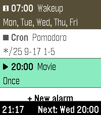

# pebble-another-alarm



A multi-alarm watchapp for Pebble (emery/Pebble Time 2 only). See `CLAUDE.md`
for architecture details.

## Features

- Multiple alarms with time, weekday repeat, snooze, vibration, and sound
  settings
- Cron-syntax alarms (minute/hour/day-of-week patterns) for repeating
  schedules that don't fit a simple weekday repeat
- Skip-next-occurrence and one-time-vs-repeating alarm states, cycled with
  a short main-list press
- Per-alarm vibration pattern, increasing-volume ramp, and auto-stop
- Phone-side Clay config page for global settings (first day of week,
  default vibe pattern, default snooze, alarm volume)

## Building & running

```sh
npm install
pebble build                          # compiles src/ts -> src/pkjs (tsc), then bundles
pebble install --emulator emery       # install on the emery emulator
pebble install --phone <ip>           # install to a paired phone
```

See the `Makefile` for other targets (`clean`, `kill_emulator`,
`wipe_emulator`, `install_cloudpebble`, `build_and_install_emulator`,
`build_and_install_cloudpebble`).

## Target platforms

`targetPlatforms` in `package.json` controls which watches you build for.
This project only targets **emery** (Pebble Time 2).

## Phone-side TypeScript, Clay & tests

Phone-side (PebbleKit JS) logic is written in TypeScript under `src/ts/` and
compiled to `src/pkjs/` by a `wscript` build hook — `src/pkjs/*.js` is
generated and gitignored, so always edit `src/ts/*.ts` instead. The config
page itself is built with [Clay](https://github.com/pebble/clay)
(`src/ts/config_clay.ts`), wired up in `src/ts/index.ts`.

```sh
npm install
npm run typecheck                     # tsc --noEmit
npm test                              # compiles TS, then runs tests/*.test.js
```

```bash
# pure C core, no Pebble SDK needed:
gcc -I src/c tests/test_alarm_calc.c src/c/alarm_calc.c -o /tmp/t && /tmp/t
```

## Project layout

```
src/c/alarm_calc.c/.h     Pure alarm scheduling logic (host-testable, no SDK)
src/c/alarm_store.c/.h    Persistence (one Alarm per persist key + settings)
src/c/main.c              UI/controller: list, edit menu, ring screen, wizard
src/c/multitap_keyboard/  Vendored Apache-2.0 keyboard widget (label entry)
src/ts/                   Phone-side TypeScript (Clay config + AppMessage),
                          compiled to src/pkjs/ on build
src/pkjs/                 Generated PebbleKit JS (gitignored, do not edit directly)
resources/                Images, fonts, and other bundled resources
tests/                    C (gcc, manual run) and node:test (npm test) tests
package.json              Project metadata (UUID, platforms, resources, message keys)
wscript                   Build rules — compiles TypeScript, then bundles as usual
```

## Documentation

Full SDK docs, tutorials, and API reference: <https://developer.repebble.com>
